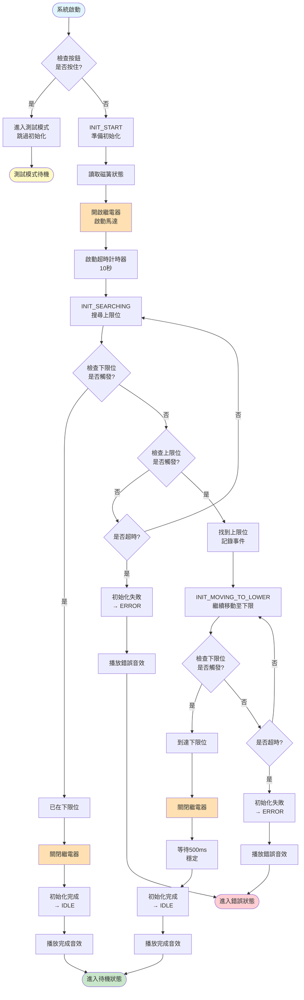
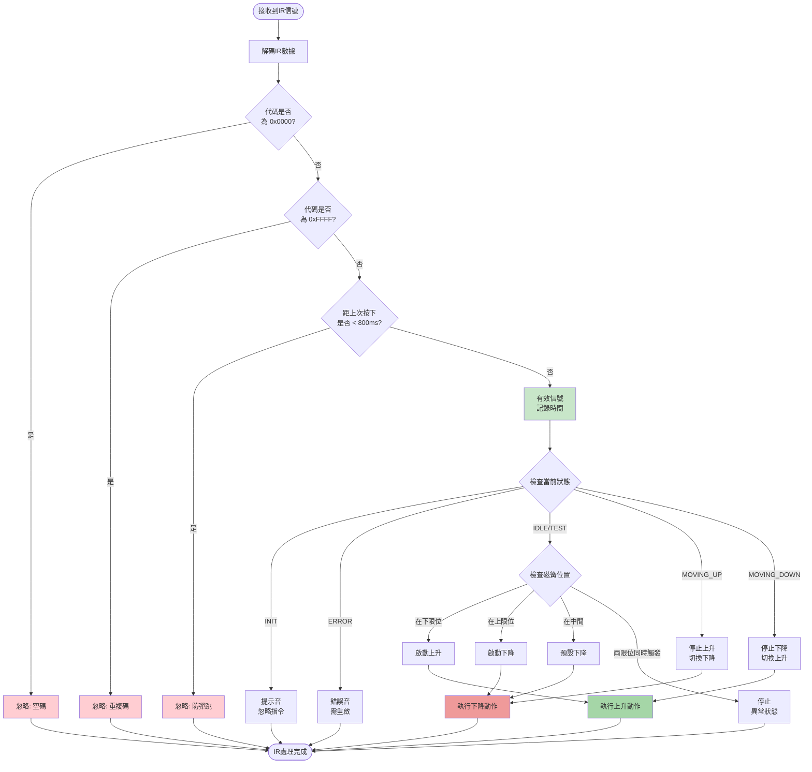
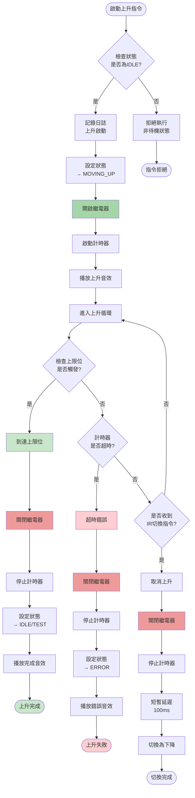
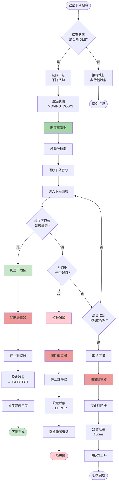
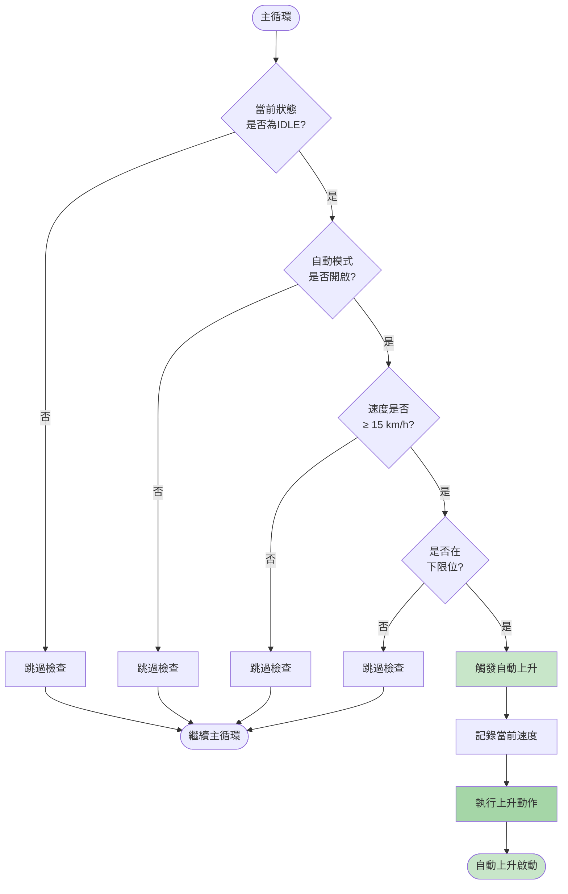
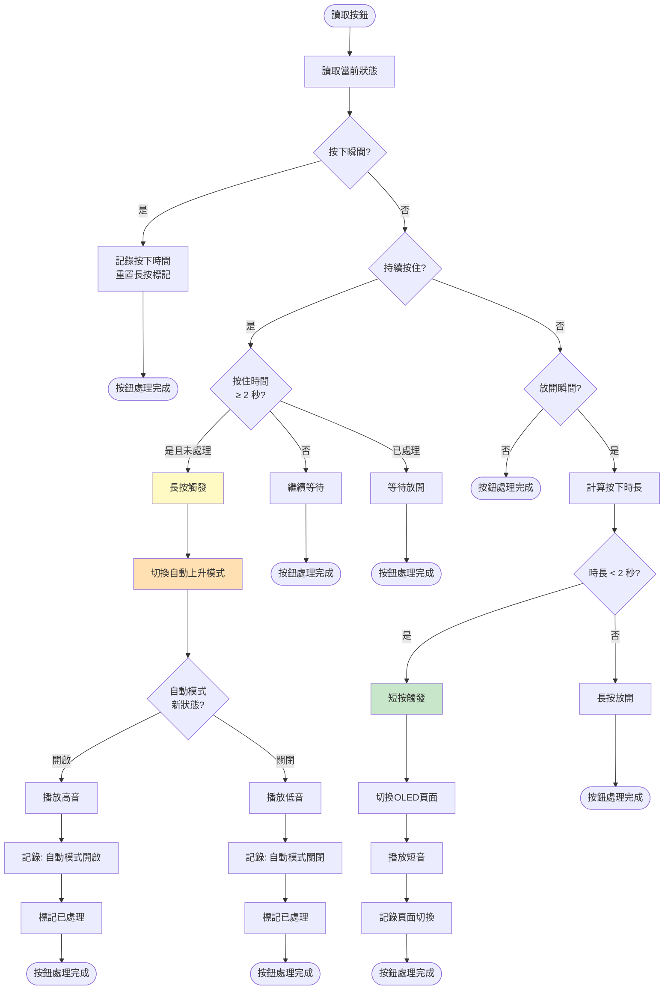
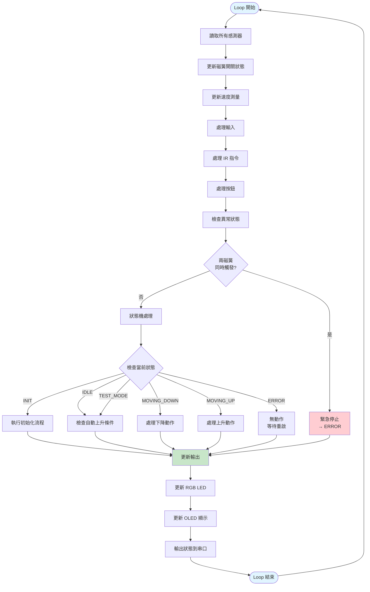
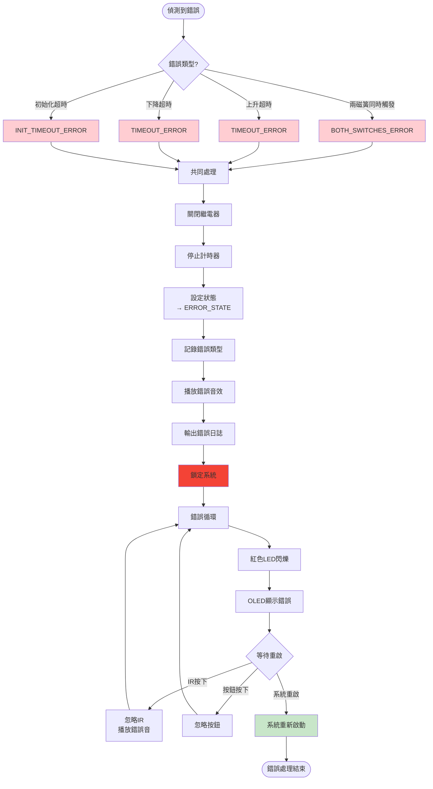
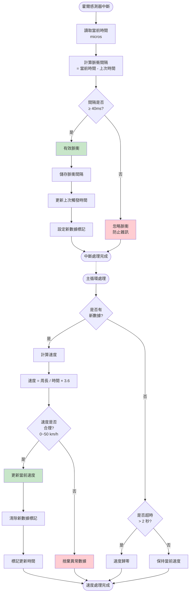

# 自行車輔助輪控制系統

## 專案概述
你的系統構想是一套完整的自行車輔助輪智能控制系統，核心目標是結合安全、可控與易於監測的功能。系統以三種主要感測資訊為偵測基礎：速度、傾斜角度與電流。速度感測可判斷車速，提供輔助輪自動收放或防跌倒的判斷依據；角度感測透過 MPU6050 或其他 IMU 取得車身傾斜資訊，用於偵測可能的傾倒風險；電流感測則可偵測線性制動器的負載狀態，防止馬達過載或異常耗電，保護硬體安全。

在控制端，你希望操作線性制動器能夠精準控制輔助輪的上升或下降。線性制動器以固定方向旋轉操作，確保機構簡單且可靠，並搭配 PWM 控制調節轉動速度，使系統能夠平滑升降，同時提供緊急斷電功能以應對意外狀況。使用者可以透過 IR 遙控器直接操作輔助輪上升或下降，例如家長在小孩快跌倒或需要完全升起輔助輪時，可即時介入。緊急停止按鈕則可隨時暫停整個系統或啟動重置流程，按下即生效，不需長按，確保快速應對意外。

顯示部分分為 OLED 與 RGB LED。OLED 顯示用於呈現精確資訊，包括即時速度、車身傾角與系統狀態，讓使用者或監護人能清楚掌握運行情況；RGB LED 則以不同顏色直觀顯示當前系統狀態，如自動控制、手動操作、安全警告或緊急停機，便於快速辨識。

軟體功能部分，I2C 通訊加入超時防護與自動重啟機制，搭配硬體看門狗，確保系統即使在通訊異常或感測器失效時，也能自我恢復，維持穩定運作。序列埠則用於除錯與診斷，輸出包括優先權、速度、角度、PWM 值、感測電流以及各種狀態訊息，方便開發與維護。整體系統的設計邏輯強調安全優先、即時控制與資訊透明，使自行車輔助輪在保護小孩安全的同時，也提供家長及使用者良好的操作體驗。
---

## 系統功能

### 1. 輔助輪控制

#### 手動模式
- **紅外線遙控**：使用紅外線遙控器切換輔助輪 UP / DOWN 狀態。  
- **磁簧開關**：偵測輔助輪上下限位，避免機構過行程。  
- **RGB LED 指示**：
  - DOWN：黃色  
  - UP：綠色  
- **音效提示**：輔助輪放下與收起時播放不同提示音。

#### 自動模式（速度控制）
- 速度 < 10 km/h → 自動放下輔助輪（磁簧確認下限）。  
- 速度 ≥ 10 km/h → 自動收起輔助輪（磁簧確認上限）。  
- **RGB LED 顯示**：
  - 低速：黃色  
  - 高速：綠色  

#### 傾斜警告保護
- 當傾斜角度 > 20° 且持續 0.5 秒：
  - 自動放下輔助輪（磁簧確認下限）  
  - RGB LED 顯示藍色  
  - 播放警告音  
- 當傾斜角度 < 12° 且持續 3 秒：
  - 自動收起輔助輪（磁簧確認上限）  
  - RGB LED 回復綠色  

#### 緊急停止（最高優先）
- 傾斜角度 > 35° 或電流過載 → 立即鎖定輔助輪下降（磁簧確認下限）、紅燈警報、播放緊急音效。  
- 當角度 < 12° 並確認安全後，解除緊急狀態。

---

### 2. 感測與控制模組
- **MPU6050**：取得加速度與角速度資料，計算即時傾斜角度。  
- **磁簧開關**：
  - 偵測輔助輪端點位置  
  - 判斷手動操作是否超過上下限  
- **速度感測模組**：透過霍爾脈衝計算即時行駛速度。  
- **紅外線接收器**：接收使用者遙控指令。  
- **INA226 電流監測**：偵測系統電流狀態，用於安全保護。

---

### 3. 顯示與互動
- **OLED 顯示器**：
  - 顯示系統狀態、輔助輪 UP/DOWN、即時速度、傾斜角度  
  - 提供啟動畫面與測試畫面  
- **RGB LED 狀態提示**：以顏色快速顯示系統目前狀態  
- **音效提示**：
  - 系統啟動提示音  
  - 輔助輪動作提示音  
  - 傾斜警告音  
  - 緊急警報音  

---

### 4. 測試功能
- OLED 顯示測試  
- 紅外線接收測試  
- MPU6050 姿態讀值測試  
- 磁簧開關與速度感測測試  
- RGB LED 顏色與音效確認  
- 測試結果同步顯示於 OLED 並以音效回饋

---

### 5. 系統設計重點
- 採用 **三層決策邏輯**：
  1. 安全層（最高優先）  
  2. 傾斜保護層  
  3. 操作控制層  
- 採用非阻塞式設計（以 `millis()` 為基礎），提升即時反應能力  
- 高風險狀態可直接中斷低優先權控制邏輯  

---

### 6. RGB LED 狀態指示
| 顏色 | 狀態說明 |
|------|-----------|
| 🟢 綠色 | 正常行駛，速度 ≥ 10 km/h，輔助輪 UP |
| 🟡 黃色 | 輔助輪 DOWN（低速或手動） |
| 🔵 藍色 | 傾斜警告（角度 > 20°） |
| 🔴 紅色 | 緊急狀態（角度 > 35° 或安全保護） |
| 🟣 紫色 | 保留狀態（未使用） |

---

### 7. 系統流程圖
```mermaid
# 輔助輪控制系統 v10.1 - 完整流程圖

## 1. 系統整體狀態機

```mermaid
stateDiagram-v2
    [*] --> 上電啟動
    
    上電啟動 --> 檢查測試模式: 讀取按鈕
    
    檢查測試模式 --> INIT: 按鈕未按下
    檢查測試模式 --> TEST_MODE: 按鈕按住
    
    INIT --> 初始化流程
    
    初始化流程 --> IDLE: 初始化成功
    初始化流程 --> ERROR: 初始化失敗
    
    IDLE --> MOVING_UP: IR指令/自動觸發
    IDLE --> MOVING_DOWN: IR指令
    
    MOVING_UP --> IDLE: 到達上限位
    MOVING_UP --> ERROR: 超時10秒
    MOVING_UP --> MOVING_DOWN: IR中途切換
    
    MOVING_DOWN --> IDLE: 到達下限位
    MOVING_DOWN --> ERROR: 超時10秒
    MOVING_DOWN --> MOVING_UP: IR中途切換
    
    TEST_MODE --> MOVING_UP: IR指令
    TEST_MODE --> MOVING_DOWN: IR指令
    
    MOVING_UP --> TEST_MODE: 測試模式到達限位
    MOVING_DOWN --> TEST_MODE: 測試模式到達限位
    
    ERROR --> [*]: 需重啟系統
    
    note right of IDLE
        RGB: 青色
        繼電器: 關閉
        等待指令
    end note
    
    note right of MOVING_UP
        RGB: 綠色
        繼電器: 開啟
        監測上限位
    end note
    
    note right of MOVING_DOWN
        RGB: 紅色
        繼電器: 開啟
        監測下限位
    end note
    
    note right of ERROR
        RGB: 紅色閃爍
        繼電器: 關閉
        系統鎖定
    end note
```

## 2. 初始化流程詳細圖



## 3. IR 控制流程



## 4. 上升動作流程



## 5. 下降動作流程



## 6. 自動上升觸發流程



## 7. 按鈕控制流程



## 8. 主循環結構



## 9. 錯誤處理流程



## 10. 速度測量流程



---

## 圖表說明

### 顏色標示：
- 🟦 **藍色**：啟動/開始節點
- 🟩 **綠色**：成功/正常執行
- 🟥 **紅色**：錯誤/失敗/停止
- 🟨 **黃色**：警告/特殊狀態
- 🟧 **橘色**：繼電器操作

### 主要流程：
1. **狀態機**：系統整體運作邏輯
2. **初始化**：自動校正找基準位置
3. **IR控制**：三層過濾機制
4. **上升/下降**：包含超時保護
5. **自動上升**：速度觸發條件
6. **按鈕**：短按/長按不同功能
7. **主循環**：每次循環的完整流程
8. **錯誤處理**：異常情況處理
9. **速度測量**：霍爾感測器中斷處理

### 關鍵保護機制：
- ✅ 10秒超時保護
- ✅ 磁簧防彈跳 50ms
- ✅ IR防彈跳 800ms
- ✅ 兩磁簧同時觸發偵測
- ✅ 速度合理性檢查
- ✅ 錯誤狀態鎖定
