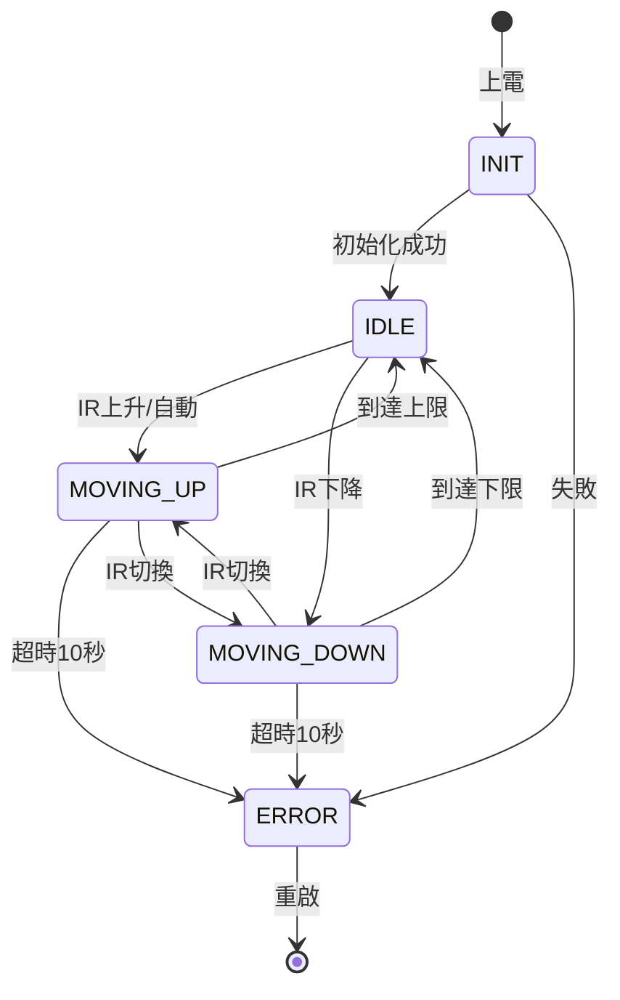
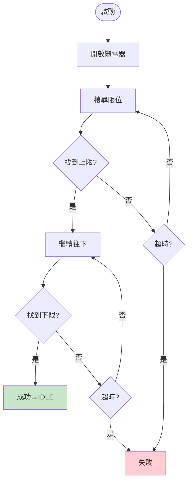
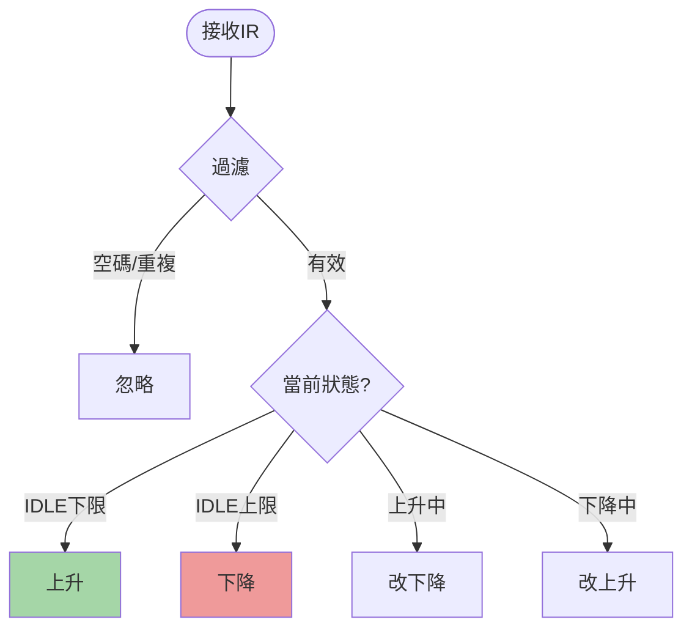
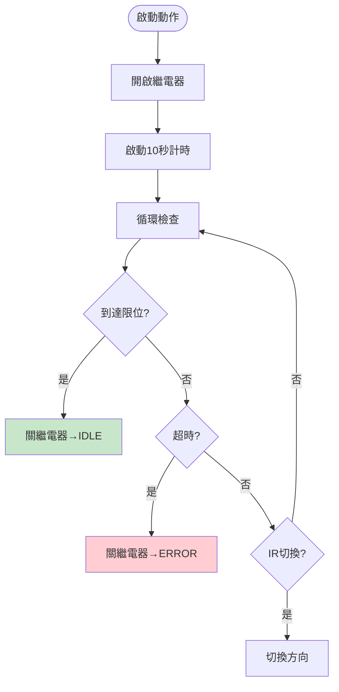
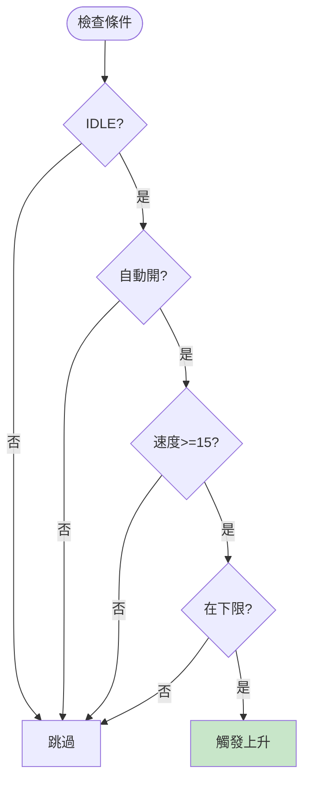
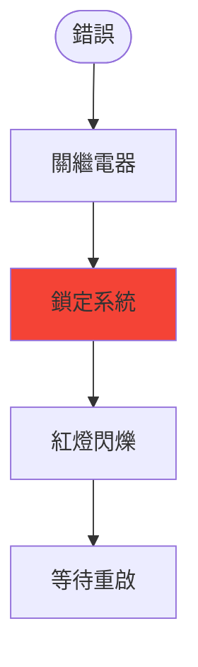

# 輔助輪控制系統 v10.1

> 🚲 基於 Arduino Mega 的智能自行車輔助輪控制系統

[](LICENSE)
[](https://www.arduino.cc/)
[](CHANGELOG.md)

## 📋 目錄

- [系統簡介](#系統簡介)
- [系統架構](#系統架構)
- [流程圖](#流程圖)
- [硬體配置](#硬體配置)
- [安裝說明](#安裝說明)
- [使用方式](#使用方式)
- [安全機制](#安全機制)
- [常見問題](#常見問題)

---

## 🎯 系統簡介

本系統為木柵高工電子科專題製作，實現智能輔助輪自動控制：

### 核心功能
- ✅ **自動初始化** - 開機自動校正位置
- ✅ **紅外線控制** - 一鍵切換上升/下降
- ✅ **速度觸發** - 達 15 km/h 自動收起
- ✅ **10 秒超時保護** - 防止機構卡死
- ✅ **OLED 即時顯示** - 中文操作介面
- ✅ **RGB 狀態指示** - 不同顏色對應不同狀態

### 三句話理解系統
1. **初始化**：開機自動找上下限位，確定基準位置
2. **控制**：IR 按一下切換上升/下降，可中途改變方向
3. **保護**：10 秒超時、限位觸發、錯誤鎖定三重保護

---

## 🏗️ 系統架構

### 整體狀態機



### 狀態說明

| 狀態 | RGB 顏色 | 繼電器 | 說明 |
|-----|---------|-------|------|
| **INIT** | 紫色閃爍 | 開啟 | 自動搜尋基準位置 |
| **IDLE** | 青色 | 關閉 | 待機，等待指令 |
| **MOVING_UP** | 綠色 | 開啟 | 上升中，監測上限位 |
| **MOVING_DOWN** | 紅色 | 開啟 | 下降中，監測下限位 |
| **ERROR** | 紅色閃爍 | 關閉 | 系統鎖定，需重啟 |

---

## 📊 流程圖

### 1. 初始化流程



**邏輯：** 開機 → 找上限 → 找下限 → 完成

---

### 2. IR 控制流程



**三層過濾機制：**
1. 空碼過濾（0x0000）
2. 重複碼過濾（0xFFFF）
3. 防彈跳過濾（800ms）

---

### 3. 上升/下降流程



**三種結束方式：**
- ✅ 正常完成 - 觸發限位開關
- ⚠️ 超時錯誤 - 10 秒未到達
- 🔄 中途切換 - IR 改變方向

---

### 4. 自動上升觸發



**四個必要條件：**
1. ✅ 狀態 = IDLE
2. ✅ 自動模式開啟
3. ✅ 速度 ≥ 15 km/h
4. ✅ 位於下限位

---

### 5. 錯誤處理流程



**錯誤類型：**
- 🔴 兩磁簧同時觸發
- 🔴 動作超時 10 秒
- 🔴 初始化失敗

---

## 🔧 硬體配置

### 腳位定義

| 功能 | 腳位 | 說明 |
|-----|------|------|
| **繼電器** | Pin 22 | 馬達電源開關（高電平觸發） |
| **蜂鳴器** | Pin 8 | 音效提示 |
| **RGB 紅** | Pin 5 | 狀態指示燈 |
| **RGB 綠** | Pin 6 | 狀態指示燈 |
| **RGB 藍** | Pin 7 | 狀態指示燈 |
| **上磁簧** | Pin 13 | 上限位開關（觸發=LOW） |
| **下磁簧** | Pin 53 | 下限位開關（觸發=LOW） |
| **霍爾感測** | Pin 2 | 速度測量（中斷） |
| **IR 接收** | Pin 3 | 紅外線遙控 |
| **按鈕** | Pin 12 | OLED 換頁 / 切換模式 |

### 系統架構圖

```
┌─────────────────────────────────────────┐
│           Arduino Mega 2560             │
│  ┌─────────────────────────────────┐   │
│  │     主控程式 (v10.1)            │   │
│  │  • 狀態機管理                   │   │
│  │  • 感測器讀取                   │   │
│  │  • 安全保護                     │   │
│  └─────────────────────────────────┘   │
└────┬──────┬──────┬──────┬──────┬────────┘
     │      │      │      │      │
  ┌──▼──┐┌──▼──┐┌──▼──┐┌──▼──┐┌──▼──┐
  │繼電器││OLED ││IR接 ││磁簧 ││霍爾 │
  │控制 ││顯示 ││收器 ││開關 ││感測 │
  └──┬──┘└─────┘└─────┘└─────┘└─────┘
     │
  ┌──▼────────────┐
  │ 獨立 PWM 模組 │
  └──┬────────────┘
     │
  ┌──▼────────────┐
  │ 線性致動器    │
  │ (旋轉型馬達) │
  └───────────────┘
```

### 材料清單

| 項目 | 規格 | 數量 |
|-----|------|------|
| Arduino Mega 2560 | - | 1 |
| 繼電器模組 | 5V 單路（高電平觸發） | 1 |
| OLED 顯示器 | 128x64 I2C | 1 |
| 線性致動器 | 12V 旋轉型 | 1 |
| 獨立 PWM 模組 | - | 1 |
| 磁簧開關 | 常開型 | 2 |
| 霍爾感測器 | A3144 | 1 |
| IR 接收器 | VS1838B | 1 |
| RGB LED | 共陰極 | 1 |
| 蜂鳴器 | 有源 5V | 1 |
| 按鈕開關 | 6x6mm | 1 |

---

## 📥 安裝說明

### 1. 安裝依賴庫

在 Arduino IDE 中安裝以下函式庫：

```cpp
// 必要函式庫
U8g2lib       // OLED 顯示
IRremote      // 紅外線接收
Wire          // I2C 通訊（內建）
```

**安裝步驟：**
1. 開啟 Arduino IDE
2. 工具 → 管理程式庫
3. 搜尋並安裝：
   - `U8g2` by olikraus
   - `IRremote` by shirriff

### 2. 上傳程式

```bash
# 1. 下載程式碼
git clone https://github.com/your-username/training-wheel-v10.1.git

# 2. 開啟 Arduino IDE
# 3. 檔案 → 開啟 → training_wheel_v10.1_debug.ino
# 4. 工具 → 板子 → Arduino Mega 2560
# 5. 工具 → 序列埠 → 選擇正確的 COM Port
# 6. 上傳
```

### 3. 接線檢查

**重要提醒：**
- ⚠️ 繼電器需獨立供電（避免 Arduino 電流不足）
- ⚠️ 磁簧開關使用內建上拉（不需外接電阻）
- ⚠️ 馬達電源與 Arduino 電源分離

---

## 🎮 使用方式

### 基本操作

#### 1. 啟動系統

```
上電 → 自動初始化（紫色閃爍）
      ↓
   找到基準位置
      ↓
   進入待機（青色燈）
```

#### 2. 手動控制

| 情況 | 按 IR | 結果 |
|-----|-------|------|
| 在下限位 | 按一下 | ▲ 上升 |
| 在上限位 | 按一下 | ▼ 下降 |
| 上升中 | 按一下 | ▼ 改下降 |
| 下降中 | 按一下 | ▲ 改上升 |

#### 3. 自動上升模式

```
長按按鈕 2 秒 → 聽到高音
                ↓
           自動模式開啟（顯示 [AUTO]）
                ↓
           騎到 15 km/h → 自動收起
                ↓
           停車後按 IR → 放下輔助輪
```

#### 4. 按鈕功能

- **短按**（< 2 秒）：切換 OLED 頁面（主頁 ⇄ 除錯頁）
- **長按**（≥ 2 秒）：切換自動上升模式 ON/OFF

---

### OLED 顯示說明

#### 主頁面

```
┌─────────────────────┐
│ 輔助輪 v10.1  [AUTO]│ ← 自動模式指示
├─────────────────────┤
│ 待機                │ ← 當前狀態
├─────────────────────┤
│ Speed: 12 km/h      │ ← 即時速度
│ UP:off  DN:ON       │ ← 磁簧狀態
│ Relay:OFF           │ ← 繼電器狀態
└─────────────────────┘
```

#### 除錯頁面

```
┌─────────────────────┐
│ 除錯資訊            │
├─────────────────────┤
│ State: 1            │ ← 狀態編號
│ Init Phase: 5       │ ← 初始化階段
│ Motion Timer: 3s    │ ← 動作計時
│ Error: 0            │ ← 錯誤碼
│ Last IR: 0xFF30CF   │ ← IR 代碼
└─────────────────────┘
```

---

### 測試模式

**啟動方式：** 按住按鈕 → 上電 → 聽到兩聲嗶嗶

**功能：**
- ✅ 跳過自動初始化
- ✅ 直接進入手動控制
- ✅ 黃色 LED 閃爍
- ✅ 適合硬體測試

**用途：**
- 🔧 測試磁簧開關
- 🔧 測試繼電器動作
- 🔧 測試 IR 接收
- 🔧 診斷硬體問題

---

## 🛡️ 安全機制

### 三重保護系統

#### 1. 超時保護（10 秒）

```
啟動動作 → 開始計時
            ↓
    10 秒內未觸發限位
            ↓
     自動關閉繼電器
            ↓
        進入錯誤狀態
```

#### 2. 限位保護

```
磁簧觸發 → 立即停止 → 關繼電器
```

**異常情況：**
```
兩磁簧同時觸發 → 緊急停止 → 錯誤狀態
```

#### 3. 錯誤鎖定

```
發生錯誤 → 關繼電器 → 鎖定系統 → 等待重啟
```

**錯誤狀態特徵：**
- 🔴 紅色 LED 閃爍
- 🔇 連續 3 聲警報
- 🚫 拒絕所有控制指令
- 🔒 需要重新上電

---

### 時間參數表

| 保護項目 | 時間設定 | 說明 |
|---------|---------|------|
| **動作超時** | 10 秒 | 上升/下降未完成 |
| **磁簧防彈跳** | 50 ms | 避免誤觸發 |
| **IR 防彈跳** | 800 ms | 避免重複指令 |
| **速度超時** | 2 秒 | 無脈衝自動歸零 |
| **初始化延遲** | 500 ms | 到位後穩定時間 |

---

## ❓ 常見問題

### Q1: 系統一直卡在初始化（紫色閃爍）？

**可能原因：**
- ❌ 磁簧開關接線錯誤
- ❌ 磁鐵距離太遠
- ❌ 機構卡住無法移動

**解決方案：**
```bash
1. 檢查 Serial Monitor (115200 baud)
2. 看是否顯示磁簧觸發訊息
3. 手動移動機構測試磁簧
4. 使用測試模式（按住按鈕啟動）
```

---

### Q2: IR 遙控器沒反應？

**診斷步驟：**

1. **檢查 Serial Monitor**
```
[IR] 忽略: 空碼        ← 正常過濾
[IR] 忽略: 重複碼      ← 正常過濾
[IR] ✓ 接收有效信號    ← 應該看到這個
```

2. **檢查接線**
- IR 接收器：VCC=5V, GND=GND, OUT=Pin 3
- 確認 IR 接收器方向正確

3. **測試其他遙控器**
- 任何紅外線遙控器都能用
- 不需要特定品牌

---

### Q3: 顯示 UP:1, DN:0 無法初始化？

**問題：** 啟動時上磁簧就觸發了

**可能原因：**
- ❌ 磁鐵一直貼在上磁簧位置
- ❌ Pin 13 接線短路
- ❌ 磁簧極性接反

**檢查方法：**
```bash
1. 打開 Serial Monitor
2. 看啟動時的磁簧狀態
3. 拔掉上磁簧接線
4. 重新啟動，看是否變 UP:0
```

---

### Q4: 按 IR 後馬達啟動又立刻停止？

**可能原因：**
- ❌ 已在限位位置（無法繼續移動）
- ❌ 磁簧一直觸發
- ❌ 繼電器供電不足

**解決方案：**
```
查看 Serial Monitor 輸出：
[限位保護] 強制停止於上限  ← 已在上限，應該按下降
[限位保護] 強制停止於下限  ← 已在下限，應該按上升
```

---

### Q5: 如何重置系統錯誤？

**方法 1：** 重新上電（推薦）

**方法 2：** 按 Arduino 的 RESET 按鈕

**方法 3：** 重新上傳程式

**注意：** 錯誤狀態下，IR 和按鈕都不會有反應

---

### Q6: 自動上升不觸發？

**檢查清單：**

```
✅ 自動模式是否開啟？
   → OLED 應顯示 [AUTO]
   → 長按按鈕 2 秒開啟

✅ 是否在下限位？
   → OLED 應顯示 DN:ON

✅ 速度是否 >= 15 km/h？
   → OLED 顯示 Speed: XX

✅ 當前狀態是否為 IDLE？
   → 不能在錯誤或移動狀態
```

---

## 📈 系統數據

### 性能指標

| 項目 | 數值 |
|-----|------|
| 響應時間 | < 100 ms |
| 動作時間 | 約 5-8 秒 |
| 超時保護 | 10 秒 |
| 速度觸發 | 15 km/h |
| 最高速度顯示 | 50 km/h |

### 速度計算

```cpp
// 公式
速度 (km/h) = (輪周長 (mm) / 脈衝間隔 (μs)) × 3.6

// 範例
輪周長 = 2042 mm (700C 輪胎)
脈衝間隔 = 100000 μs (0.1秒)
速度 = (2042 / 100000) × 3.6 = 73.5 km/h
```

---

## 🎓 口試重點

### 五個必問題目

#### Q1: 為什麼需要初始化？
**A:** 開機時系統不知道當前位置，必須透過磁簧開關找到基準點（下限位），才能確保後續動作的準確性。

#### Q2: 如何防止機構卡住？
**A:** 使用 10 秒超時保護機制，當動作啟動後若 10 秒內未觸發限位開關，系統會自動關閉繼電器並進入錯誤狀態，防止馬達持續運轉造成損壞。

#### Q3: IR 為什麼需要三層過濾？
**A:** 
1. **第一層** - 空碼過濾（0x0000）：避免雜訊觸發
2. **第二層** - 重複碼過濾（0xFFFF）：避免按住連續觸發
3. **第三層** - 防彈跳過濾（800ms）：確保每次按下只執行一次

#### Q4: 自動上升如何觸發？
**A:** 需同時滿足 4 個條件：
1. 系統狀態 = IDLE（待機）
2. 自動模式已開啟
3. 速度 ≥ 15 km/h
4. 位於下限位

#### Q5: 錯誤如何處理？
**A:** 三步驟處理：
1. 立即關閉繼電器（馬達斷電）
2. 鎖定系統（拒絕所有指令）
3. 等待重啟（需人工介入）

---

### 設計亮點

1. **狀態機設計** - 清楚的狀態轉換，易於維護
2. **多重保護** - 超時、限位、錯誤鎖定三重保護
3. **功率分離** - Arduino 只控制繼電器，不直接驅動馬達
4. **用戶回饋** - RGB、OLED、蜂鳴器三種即時回饋
5. **診斷功能** - 測試模式、Serial 詳細日誌

---

## 📝 版本資訊

### v10.1 (2026-01-08)
- ✅ 完整中文註解
- ✅ 增強診斷輸出
- ✅ IR 三層過濾優化
- ✅ 測試模式（按住按鈕啟動）
- ✅ 詳細磁簧狀態監測

### v10.0 (2026-01-07)
- ✅ 初始版本
- ✅ 基本功能實現
- ✅ 繼電器控制架構
- ✅ 移除 IMU 相關代碼

---

## 📜 授權

本專題採用 MIT 授權條款。

---

## 👥 團隊成員

- **林恩** - 木柵高工電子科
- **指導老師** - XXX 老師

---

## 🙏 致謝

感謝以下開源專案：
- [U8g2](https://github.com/olikraus/u8g2) - OLED 顯示函式庫
- [IRremote](https://github.com/Arduino-IRremote/Arduino-IRremote) - 紅外線接收函式庫
- [Arduino](https://www.arduino.cc/) - 開發平台

---

## 📞 聯絡方式

如有問題或建議，歡迎聯絡：
- GitHub Issues: [提交問題](https://github.com/your-username/training-wheel-v10.1/issues)
- Email: your-email@example.com

---

<div align="center">

**⭐ 如果這個專題對你有幫助，請給個 Star！**

Made with ❤️ by 木柵高工電子科

</div>
